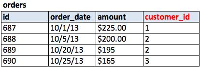
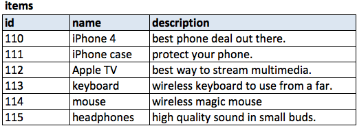

<link rel="stylesheet" href="../../../../md-framework.css">
INDEX

1. [Install MySQL Workbench](#)
1. [ERD](#mysql---erd)
1. [Database Design](#database-design)
1. [One to One](#one-to-one)
1. [One to Many](#one-to-many)
1. [Normalization](#-normalization)
1. [Conventions](#conventions)
1. [Data Types](#data-types)

# Intro to MySQL

 

OBJECTIVES

    + [ ] How to create an ERD  
    + [ ] Go over db normalization  
    + [ ] How to ID and create relationships  
    + [ ] Set up default values ie: now() for created_at  
    + [ ] Use of Cascade for deleting rows in relationships  

 

## MySQL Workbench

MySQL Workbench is just a Graphical User Interface (GUI) for us to interact with MySQL, one of the most popular relational databases in the world - through SQL commands. It is not necessary to use a GUI. We may interact with our MySQL databases through the terminal, but the GUI makes it much easier to see our data and create new databases.

download here: http://dev.mysql.com/downloads/workbench/#downloads

## MySQL - ERD

 

OBJECTIVES

    <ol>
        <li>Understand what an ERD is</li>
    </ol>

 

### what is ERD?

ERD is the abbreviation for **'Entity Relationship Diagram'**. That is just a fancy way of saying that ERDs are essentially **visual** planes of how your **database looks and behaves**. ERD and SQL work together very intimately. An ERD is a map of the structure of how we want to store our data, and SQL is the language we use to manipulate the data according to the relationships we define in our ERD. Learning the design of the database first will help us visualize what our relational databases look like, which makes it much easier to choose the actual SQL syntax.

### Why ERD?

ERD is a **process of designing your tables and establishing relationships** between them, making your data relational. Almost all imaginable data can be stored in a relational way, there really isn't anything you can't do using a relational database like MySQL. Later, you will learn non-relational databases where everything is stored in a single table. There are advantages and disadvantages for both, but we find that it is much easier to move from a relational database to a non-relational database.

- [ ] Relational db vs nonrelational db

## MySQL - One to One

Does anybody know what the inside of a db file looks like?

Talking points

1. [X] Looking into a db is like looking into a excel sheet
1. [X] Consist of Rows and Columns
1. [X] Each table belongs to an object/model - company, employees, allergies, etc.
1. [X] Each objects that you create have an ID's which is unique to that row and is never repeated.
1. Each object will also have other attributes such as name, age, etc. but these might not be unique to that row. For example there might be two people who have brown hair.

based off the name and what you know, What do you think a one to one relationship means? 

You can think of a relationship as a bridge or a gateway. It links one object to another object. Therefore, it links one object to only one other object.

Can you think of things that might have a one to one relationship? and remember a lot of these can be made to be either a one to many or one to one, depending on how you look at it.

-   monkey and a banana
-   person and a pair of shoes

**NOTE:**
Through that link you can actually access the attributes of the object you are connecting to.

So we build this bridge though something called ForeignKeys. Basically you have a column in your table that has the unique ID to the other table you want to reference.

### talking points:
- [X] id is unique to table
    - [X] incremented by 1 and starts at 0
    - [X] never repeats
- [X] foreign Key -> reference to another table

### Example:

PEOPLE

| id | first_name | last_name | address_id |
|----|------------|-----------|------------|
| 1  | Randall    | Frisk     | 4          |
| 2  | Michael    | Choi      | 5          |
| 3  | Dexter     | Clark     | 6          |

ADDRESSES

| id | street       | city         | state |
|----|--------------|--------------|-------|
| 4  | 576 Stell In | Grass Valley | NY    |
| 5  | 333 Ninja Dr | Seattle      | WA    |
| 6  | 978 Flip In  | San Jose     | CA    |

## MySQL - One to Many

One to many is pretty much the same as a one to one relationship aside from the fact that you can have multiple of the same id's in multiple rows.

ORDERS
| id | ORDER_DATE | AMOUNT  | CUSTOMER_ID |
|----|------------|---------|-------------|
| 4  | 10/1/13    | $225.00 | 1           |
| 5  | 10/5/13    | $200.00 | 1           |
| 6  | 1020/13    | $195.00 | 2           |

## MySQL - many to many

| img name | img                          | desc                                             |
|----------|------------------------------|--------------------------------------------------|
| TABLE 1  |  |                                                  |
| TABLE 2  |  |                                                  |
| TABLE 3  |  | A combination of the unique id's on both tables. |

## Normalization

Database normalization is simply a convention for splitting large tables of data into smaller separate tables with the primary goal being to not repeat data.

| id  | name           | address             |
| --- | -------------- | ------------------- |
| 1   | tyler Thibault | 1234 somewhere cool |
| 2   | Shawn Converse | 9876 somewhere else |
| 3   | Tommy Topper   | 3456 onTop Rd.      |

Things to be aware of when thinking about Normalization.

1. Each column should have only one piece of information
1. There should not be repeated information
    - instead use foreignKeys or another table's UID
1. We don't want info in one column that is dependant on info in another column but is not directly related to the table.

**Books** (Bad)

| id  | name            | pub_name      | pub_rank |
| --- | --------------- | ------------- | -------- |
| 1   | Mathematices    | pearson       | 2        |
| 2   | Physics         | Reed Elsevier | 5        |
| 3   | Hacking Exposed | McGraw-Hill   | 7        |

**Books** (Good)

| id  | name            | pub_id |
| --- | --------------- | ------ |
| 1   | Mathematices    | 1      |
| 2   | Physics         | 2      |
| 3   | Hacking Exposed | 3      |

**Publishers** (Good)

| id  | name          | pub_rank |
| --- | ------------- | -------- |
| 1   | pearson       | 2        |
| 2   | Reed Elsevier | 5        |
| 3   | McGraw-Hill   | 7        |

-   First Form

    Each Column in your table can only have 1 value.

    Ex. You should not have an address column in your table that lists the address, city, state, and zip, all separated by commas.

-   Second Form
    Each Column in your table that is not a key (primary or foreign) must have unique values.

    Ex. If you have a movies table with a categories column, you should not have a category repeated more than once.

-   Third Form
    You cannot have a non-key column that is dependent on another non-key column.

    Ex. If you have a books table with columns publisher_name and publisher_address, the publisher_address and publisher_name should be separated into a separate table and linked to books with a foreign key. The publisher_address is dependent on the publisher_name and neither column is a key column.

## Conventions

Why do we use Conventions?

1. Developers can have a better understanding of your database if you are using a set of industry standards.
1. Developers can create software to automate a lot of the queries if some assumptions can be made. In later chapters, you will learn about Object Relational Mappers (ORM), which are programs that other developers use to make database queries easier by providing some handy functions. These functions will only work if we have followed conventions that ORM author expects, which are primarily based on set industry standards.

### Guidelines

1. Table names are plural and **ALL** lowercase
1. use "id" as the primary key - (make it auto-incremented)
1. foreign keys are singular_table_name_id
1. use created_at and updated_at in **EVERY** table

## Data Types

### Simple Data Types:

[Data Types (LP Link)](https://login.codingdojo.com/m/172/7217/52091)

1. VARCHAR(number of characters)
    - Used to store non-numeric values that can be up to 255 characters. It is called a VARCHAR because it can store a variable number of characters and will only use the space required for each record that is stored in the database. VARCHAR should be used for values with different character lengths like an email, first_name, or last_name.
1. CHAR(number of characters)
    - Also used to store non-numeric values, however, it will use up all space for the set number of characters regardless of what value is added. For instance, if I set CHAR(15), and I try to store the value "Coding", it will use up the equivalent of 15 characters even though "Coding" is only 6 characters long. Char is good to use for things that will always be a given number of characters. Char would work well for something like a state_abbreviation.
1. INT

    - Used to store integers.
    - The columns that you will find mostly using the INT are things like a unique identifier for each table. The majority of rows in a table will not exceed 2.1 billion records. INT is good to use for most normal number values like a phone_number or a zip_code.
    - unsigned (positive numbers only) - can store numerical values from 0 up to 4294967295
    - signed (positive and negative numbers) - can store numerical values from -2147483648 up to 2147483647

1. BIGINT

    - BIGINT would be used for columns that would need to store huge numbers. In most cases, you wouldn't need BIGINT, but if you wanted to store something like a Facebook id when using Facebook's API, since they have over a billion users the id will need to be a data type of BIGINT.
    - unsigned (again positive numbers only) - can store numerical values from 0 up to 18446744073709551615
    - signed (positive and negative numbers) - can store numerical values from 9223372036854775807 to -9223372036854775808.

1. TINYINT

    - TINYINT would be good to use for numbers that will be relatively small. A good example of something that would use a TINYINT is user level identifier (0 - inactive user, 1 - active user, 9 - admin).
    - unsigned - can store numerical values from 0 up to 255
    - signed - can store numerical values from -128 up to 127

1. FLOAT

    - Used to store floating point numbers (numbers that need to have decimal places). An example column for this would be like an item_cost.

1. TEXT

    - Used to store a large amount of text, like a description, message, or comment. Use this for any text that VARCHAR() is too small to handle.

1. DATETIME
    - used to store a date and time in the format YYYY-MM-DD hh:mm:ss
