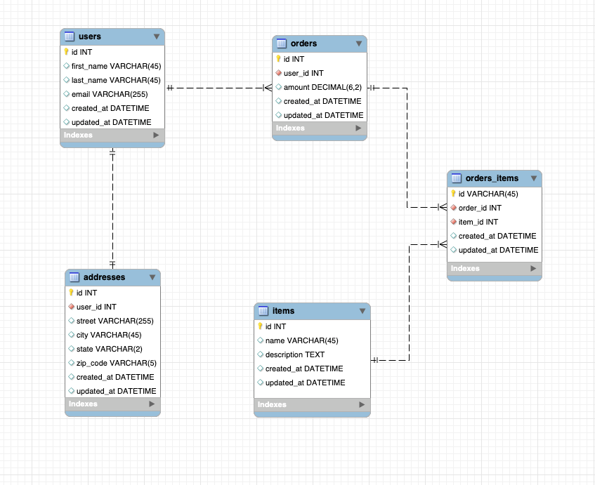

<link rel="stylesheet" href="../../../../md-framework.css">

# Demo build ERD

Pick one of the following to demo. Then have the students work together to build a fake [facebook activity](#fake-facebook-activity )

1. [Event_Planner](#event-planner)
1. [User Dashboard](#user-dashboard)
1. [Users and Orders](#users-and-orders)

## Twitter

## Reddit

## Users and Orders

## Fake Facebook Activity
Imagine that you wanted to create an application like Facebook.  What database tables would you create and what fields would you create in each table?

On the whiteboard, show an example of how you could create the first two database tables and explain your rationale.  Then, have students pair up and come up with simple ERD for how they may design the database tables for Facebook.  Have some students present afterwards where you can highlight good database design or database design that need further work.  Tell students that we don't want them to design more than 6-7 database tables (and therefore to focus on the most important features first).