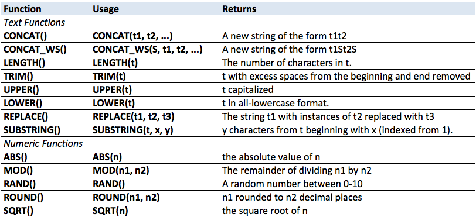
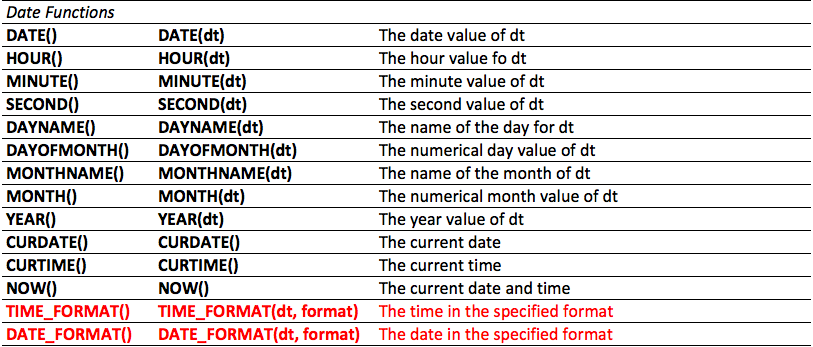
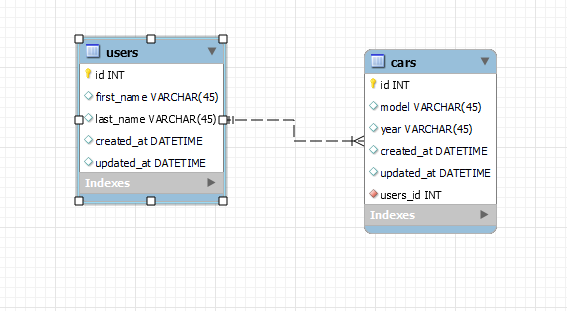
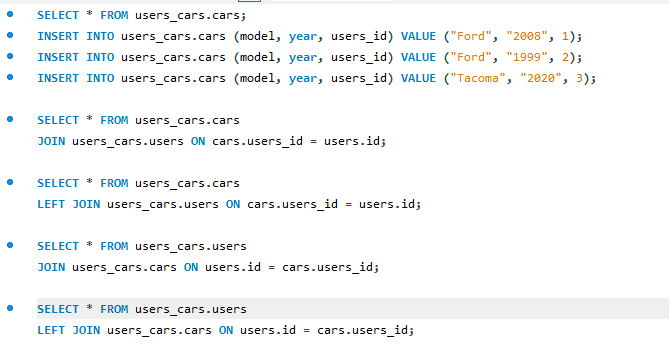
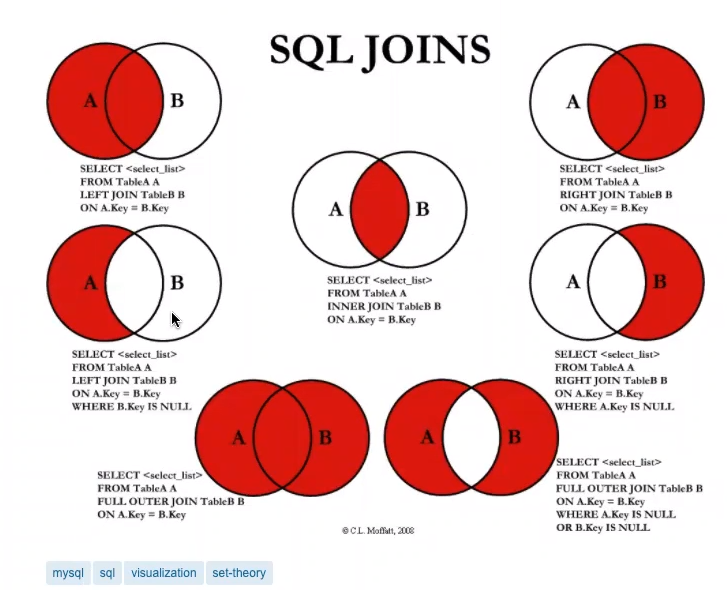
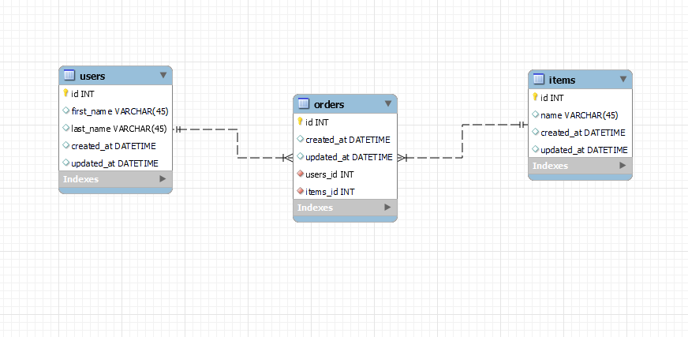
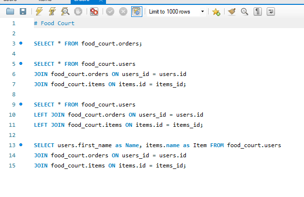

<link rel="stylesheet" href="../../../../md-framework.css">

# Afternoon

## Functions

1. concat()
    ```sql
    SELECT CONCAT("Mr.", column_1, column_1) AS fullName FROM table_name
    ```
1. concat_ws()
    ```sql
    SELECT CONCAT_WS(" ", column_1, column_1) AS fullName FROM table_name
    ```
1. length()
    ```sql
    SELECT LENGTH(column_name) FROM table_name
    ```
1. lower()
    ```sql
    SELECT LOWER(column_name) FROM table_name
    ```




## Join
1. design our tables to maximize for storage -> don't repeat yourself
1. because all we have in our first table is the id of the row of the other table we need to merge them together. -> this is where we use *JOIN*. 

### User and cars



CHECKLIST
- [ ] build out ERD
- [ ] convert into db
- [ ] seed the models
- [ ] join one table to another
- [ ] show left join

---
1. One to One
    ```sql
    SELECT * FROM table_1_name
    JOIN table_1_name ON table_1_name.column_name = table_2_name.column_name
    ```
1. one to many
    ```sql
    SELECT * FROM table_1_name
    JOIN table_1_name ON table_1_name.column_name = table_2_name.column_name
    ```
1. many to many
    ```sql
    SELECT * FROM orders 
    JOIN items_orders ON orders.id = items_orders.order_id 
    JOIN items ON items.id = items_orders.item_id;
    ```



## Left Join
<span class="question">What is the difference between JOIN and LEFT JOIN and when would we use each?</span>

1. join will get us all the documents regardless if they have an associated value with them
1. left join will leave out documents if they don't have the associated value.

<div class="watchout-bg">
    <span class="watchout-text">Show the difference between the two</span>
</div>

## Many to Many Join
build a new erd and db -> food_court




- [ ] build the ERD
- [ ] convert into db
- [ ] seed the models
- [ ] show connections from one table to another
- [ ] then connect the 2nd table in the same command
- [ ] show how you can leave out information

