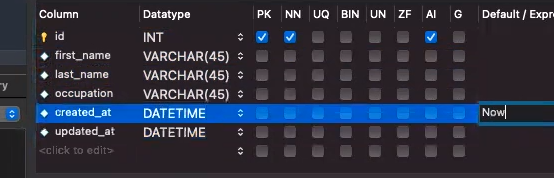

<link rel="stylesheet" href="../../../../md-framework.css">

# Flask + Mysql

## Connecting to a db
### Mysql connection file
1. two places you will need to change
    user = 'root'
    password = 'password'
1. def query_db(self, query, data=None)
    - takes in one param with an optional data param
    - conditionals
        - if inserts (line 23) will return the id that was just created
        - if select (line 27) will return the result
        - else it won't return anything (line 33)
        - if there was an error print and return false
        - close the connection
1. Check the dots!!!

### server file
1. the import statement must be the same name as the file we just created. 
1. change the name of the db

---
1. Create a new db "first_flask"

1. populate table with minimal data
---

## Retrieving data
1. Walk through the index method.
    - connectToMySQL -> takes in 1 param
    - call a query to the db
    - call a template and pass in the return of the query
1. in the index.html file
    - walk through the information given to show that it is just a dict with a list inside. 


## Queriering the db
using the users db that was created we can create another route that will show just that user when we put in the ID of that user into the URL. 

1. create new route
```py 
@app.route('/users/<id>)
def show(id):
    mysql = connectionToMySQL('first_flask')

    query = "SELECT * FROM friends WHERE id = %(key)s"
    data = {
        "key": id
    }
    friend = mysql.query_db(query, data)
    return render_template('index.html', all_friends = friends)
```
**demo sql injection**

## From Form to db
build out a simple CR(u)D (no update) application to show how the we would take info from a form and put it into the db. 

### server file
```py
from flask import Flask, render_template, redirect, request, session
from mysqlconnection import connectToMySQL    # import the function that will return an instance of a connection
import random
app = Flask(__name__)
app.secret_key = 'keep it secret, keep it safe'

@app.route('/return_string')
def hello_world():
    return 'Hello World!'

# TODO: create a templates folder
@app.route('/')
def index():
    mysql = connectToMySQL('first_flask') # call the function, passing in the name of our db
    friends = mysql.query_db('SELECT * FROM users;')  # call the query_db function, pass in the query as a string
    print(friends)
    return render_template("index.html", all_friends = friends)

@app.route('/users/<id>')
def show(id):
    mysql = connectToMySQL('first_flask')
    query = 'SELECT * FROM users WHERE id = %(id)s;'
    data = {
        "id": id
    }
    friend = mysql.query_db(query, data)
    return render_template('index.html', all_friends = friend)

@app.route('/user/create', methods=['POST'])
def new_user():
     mysql = connectToMySQL('first_flask')
     query = 'INSERT INTO users (first_name, last_name, occupation) VALUES (%(first_name)s, %(last_name)s, %(occupation)s);'
     data = {
         "first_name": request.form['first_name'],
         "last_name": request.form['last_name'],
         "occupation": request.form['occupation'],
     }
     new_user = mysql.query_db(query, data)
     return redirect('/')


if __name__=="__main__":
    app.run(debug=True)
```


### html file
```html
<!DOCTYPE html>
<html lang="en">
<head>
    <meta charset="UTF-8">
    <meta http-equiv="X-UA-Compatible" content="IE=edge">
    <meta name="viewport" content="width=device-width, initial-scale=1.0">
    <title>Document</title>
</head>
<body>
    <h1>Index Page</h1>
    
        <p>{{user.first_name}} {{user.last_name}}</p>
    

    <form action="/user/create" method="post">
        <input type="text" name="first_name" placeholder="First Name">
        <input type="text" name="last_name" placeholder="Last Name">
        <input type="text" name="occupation" placeholder="Occupation">
        <button>Make it so!</button>
    </form>
</body>
</html>
```