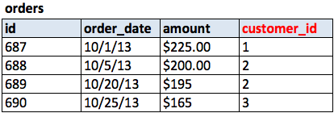
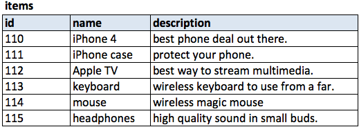
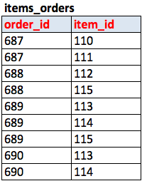

<link rel="stylesheet" href="../../md-framework.css">

INDEX

1. [Install MySQL Workbench](#)
1. [ERD](#)
1. [Database Design](#)
1. [One to One](#)
1. [One to Many](#)
1. [Normalization](#)
1. [Conventions](#)
1. [Data Types](#)
1. [Simple Blog](#)

# Intro to MySQL

 

OBJECTIVES

    <ol>
        <li>Understand how to install MySQL</li>
    </ol>

 

## MySQL Workbench

MySQL Workbench is just a Graphical User Interface (GUI) for us to interact with MySQL, one of the most popular relational databases in the world - through SQL commands. It is not necessary to use a GUI. We may interact with our MySQL databases through the terminal, but the GUI makes it much easier to see our data and create new databases.

download here: http://dev.mysql.com/downloads/workbench/#downloads

## MySQL - ERD

 

OBJECTIVES

    <ol>
        <li>Understand what an ERD is</li>
    </ol>

 

### what is ERD?

ERD is the abbreviation for 'Entity Relationship Diagram'. That is just a fancy way of saying that ERDs are essentially visual planes of how your database looks and behaves. ERD and SQL work together very intimately. An ERD is a map of the structure of how we want to store our data, and SQL is the language we use to manipulate the data according to the relationships we define in our ERD. Learning the design of the database first will help us visualize what our relational databases look like, which makes it much easier to choose the actual SQL syntax.

### Why ERD?

ERD is a process of designing your tables and establishing relationships between them, making your data relational. Almost all imaginable data can be stored in a relational way, there really isn't anything you can't do using a relational database like MySQL. Later, you will learn non-relational databases where everything is stored in a single table. There are advantages and disadvantages for both, but we find that it is much easier to move from a relational database to a non-relational database.

## MySQL - One to One

Does anybody know what the inside of a db file looks like?

Talking points

1. Looking into a db is like looking into a excel sheet
1. Consist of Rows and Columns
1. Each table belongs to an object/model - company, employees, allergies, etc.
1. Each objects that you create have an ID's which is unique to that row and is never repeated.
1. Each object will also have other attributes such as name, age, etc. but these might not be unique to that row. For example there might be two people who have brown hair.

based off the name and what you know, What do you think a one to one relationship means? 

You can think of a relationship as a bridge or a gateway. It links one object to another object. Therefore, it links one object to only one other object.

Can you think of things that might have a one to one relationship? and remember a lot of these can be made to be either a one to many or one to one, depending on how you look at it.

-   monkey and a banana
-   person and a pair of shoes

**NOTE:**
Through that link you can actually access the attributes of the object you are connecting to.

So we build this bridge though something called ForeignKeys. Basically you have a column in your table that has the unique ID to the other table you want to reference.

### Example:

PEOPLE

| id  | first_name | last_name | address_id |
| --- | ---------- | --------- | ---------- |
| 1   | Randall    | Frisk     | 4          |
| 2   | Michael    | Choi      | 5          |
| 3   | Dexter     | Clark     | 6          |

ADDRESSES

| id  | street       | city         | state |
| --- | ------------ | ------------ | ----- |
| 4   | 576 Stell In | Grass Valley | NY    |
| 5   | 333 Ninja Dr | Seattle      | WA    |
| 6   | 978 Flip In  | San Jose     | CA    |

## MySQL - One to Many

One to many is pretty much the same as a one to one relationship aside from the fact that you can have multiple of the same id's in multiple rows.

ORDERS
| id | ORDER_DATE | AMOUNT | CUSTOMER_ID |
| -- | ---------- | ------ | ----------- |
| 4 | 10/1/13 | $225.00 | 1 |
| 5 | 10/5/13 | $200.00 | 1 |
| 6 | 1020/13 | $195.00 | 2 |

## MySQL - many to many

| img name | img                          | desc                                             |
| -------- | ---------------------------- | ------------------------------------------------ |
| TABLE 1  |  |                                                  |
| TABLE 2  |  |                                                  |
| TABLE 3  |  | A combination of the unique id's on both tables. |

## Normalization
