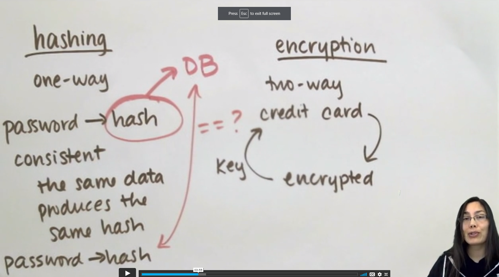

<link rel="stylesheet" href="../../../../md-framework.css">

# Bcrypt

<span class="question">What is Bcrypt? why do we want to use it?</span>

- [ ] Bcrypt is a hashing method

## THEORY

- [ ] Hashing VS Encrypting
    
- [ ] db should NEVER store raw pws
- [ ] No one should ever see the raw pws other than the user
- [ ] compare has with has
- [ ] salts
    - what are they and why do we use them?
    - [ ] random string 
    - [ ] hacker can find the salt and crack the algo
    - [ ] bcrypt makes this a slow process by design -> end goal is to make it take a LONG time for the hackers that it is not worth it. 
        - md5()
        - shal()

## IN PRACTICE
- [ ] must install from the shell
    ```
    pipenv install flask-bcrypt
    ```
- [ ] must enclude in our models where we will be using it
    ```py
    from flask_bcrypt import Bcrypt        
    bcrypt = Bcrypt(app)     # we are creating an object called bcrypt, 
                         # which is made by invoking the function Bcrypt with our app as an argument
    ```
- [ ] Use of bcrypt:
    - Generate a hash
        ```py
        bcrypt.generate_password_hash(password_string)
        ```
    - Compare passwords
        ```py
        bcrypt.check_password_hash(hashed_password, password_string)
        ```
- [ ] breakdown of Bcrypt
    - after the first $ -> brcrypt id
    - after next $ -> number of rounds (this makes it slow)
    - after next $ -> is the salt
    - then the hash
    