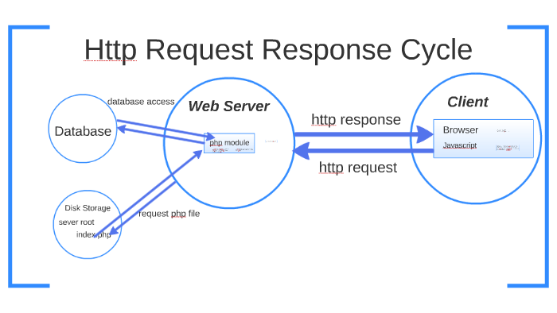

d# W1D4 Morning

<link rel="stylesheet" href="../../style.css">

### Objectives

1. Students will understand the steps needed to get a flask project up and running
1. Students will understand the HTTP response cycle
1. Students will grasp the idea of routes, why we use them and how to use them
1. Students will understand what the template engine is that we use and be exposed to the details of how to use them.

### Goals

- Steps needed to start a flask project
- Look at the HTTP response cycle
- Understand routes
- understand the template engine

### Overview

- [Virtual Environment](#Virtual-Environment)
- [Sever file](#Sever-file)
- [Routes](#Routes)
- [HTTP Response Cycle](#HTTP-Response-Cycle)
- [Rendering Views](#Rendering-Views)
- [Template Engines](#Template-Engines)

<hr>

## Virtual Environment

<div class="box white pill">

- What is it's purpose?
- Why is it important?
- How do we make this happen?

</div>

- What is it's purpose?

  - it is a container -> like a box
  - keeps dependancies seperate
  - working on two instances of python -> don't want to mix

- Why is it important?

  - code is different from version to version
  - If you totally botch everything
    - delete the virtual environment and start over

- How do we make this happen?

<div class="box">

1. Install pipenv

   ```
   pip install pipenv
   OR
   pip3 install pipenv
   ```

1. Navigate into the folder your project is in

   - NOTE: if you look this process up on the internet you might find another way they do it where they put all the venv into one folder, _HOWEVER_ that isn't how we do it in this stack anymore.

   ```
   pipenv install flask

   python -m pipenv install flask
   OR
   python3 -m pipenv install flask
   ```

   - set up allias

1. Activate your venv
   ```
   pipenv shell
   OR
   python -m pipenv shell
   ```
1. GTG
1. Deactivate

   ```
   exit
   ```

</div>

## Sever file

<div class="box pill white">

- What is it's purpose?
- Where do we put this file?
- How do we make this happen?

</div>

- What is it's purpose?
  - file that runs everything
  - connection point that will be listening to the URL and connect it with the routes
  - Think of it as an orchestra conductor
    - doesn't do much
    - but is very important
- Where do we put this file?
  - file one level deep in the project folder
- How do we make this happen?

  <div class="box">

- good time to show them "touch server.py"
- good time to show them "code ."

```py
from flask import Flask  # Import Flask to allow us to create our app
app = Flask(__name__)    # Create a new instance of the Flask class called "app"

@app.route('/')          # The "@" decorator associates this route with the function immediately following
def hello_world():
    return 'Hello World!'  # Return the string 'Hello World!' as a response


if __name__=="__main__":   # Ensure this file is being run directly and not from a different module
    app.run(debug=True)    # Run the app in debug mode
```

</div>

_Additional notes_

- keeping the 'if \_\_name** = "\_\_main**"' at the bottom
- Talk about setting up a checklist on how to create a base application.

## Routes

<div class="box white pill">

- What is a route
- Why are routes important?
- Where will we put routes?
- When do we use routes?
- How do we make this happen?

</div>

- What is a route

  ```
  If you were to think of it as a one-way street, then what would be a route?

  ** Not a perfect example**
  On this street cars can travel how many directions? So if we needed to get back we would have to build another street to allow traffic to go that way
  ```

  - the flow of data

  ### HTTP Response Cycle

  

- Why are routes important?
  - Direct the flow of the data and tell it where to do and what functions to run
- Where will we put routes?
  - in our controller file
- When do we use routes?
  - When we want to direct the flow of traffic from the client
  - not always going to be something you render a page
- How do we make this happen?

<div class="box">

```py
from flask import Flask  # Import Flask to allow us to create our app
app = Flask(__name__)    # Create a new instance of the Flask class called "app"

@app.route('/')          # The "@" decorator associates this route with the function immediately following
def hello_world():
    return 'Hello World!'  # Return the string 'Hello World!' as a response


if __name__=="__main__":   # Ensure this file is being run directly and not from a different module
    app.run(debug=True)    # Run the app in debug mode
```

</div>

## Rendering Views

<div class="box white pill">

- What is a view?
- Why do we want to use views?
- Where do we render views at?
- How do we make this happen?

</div>

- What is a view?

  - "a view is the html page that the end user will see"

- Why do we want to use views?

  - page would be boring without views

- Where do we render views at?

  - in our controller at the end of the function

- How do we make this happen?

<div class="box">

- from flask import render_templates
- return the render_template at the end of the function
- render_template take two arguments
  - the html name
  - any information you want to pass to the html file.

```py
return render_template("index.html", var1=var1, var2=var2)
```

</div>

## Template Engines

<div class="box white pill">

- What are template engines?
- What template engine do we use?
- Why is it important?
- What are the important areas to pay attention to?
- How do we make this happen?

</div>

- What are template engines?

  - a way to get information to show up on the html file
  - a way to do logic on the html file
  - IMPORTANT: the html file is parsed before actually getting displayed. If you had stuff that was in an if check that wasn't coming back as true then the actually end user html page would not render that content

- What template engine do we use?
  - 
  - {{user.first_name}}
- Why is it important?
  - is the end point of the data stream
  - the point of the application is that we can change stuff based off of the end users circumstances.
- What are the important areas to pay attention to?
  - {{ }}
  - 
  - while it looks like python it is not actually python.
    - 
